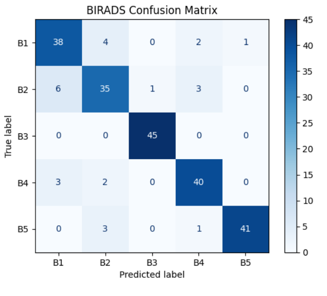

## BIRADS Breast Cancer Classification

A deep-learning based breast cancer imaging classifier that predicts BIRADS categories from mammography/ultrasound images. The system assists radiologists by automating detection and severity estimation based on lesion characteristics.

### Project Overview

This project implements a complete pipeline for breast cancer abnormality classification using the BIRADS scoring system. It includes:

Data loading and preprocessing/Augmentation

CNN-based model training

Evaluation metrics

Inference script for real image predictions

The classification helps categorize lesions from benign → highly suspicious, improving diagnostic speed & consistency in screening workflows.

Directory Structure 
birads_classifier/ 
│── app/                     # API / UI (if implemented) 
│── config/                  # Configuration YAMLs 
│── data/                    # Dataset (ignored in git) 
│── models/                  # Model architectures 
│── training/                # Training and validation scripts 
│── checkpoints/             # Trained model weights 
│── outputs/                 # Predictions / plots 
│── utils/                   # Helper functions 
│── main.py                  # Main execution file 
│── requirements.txt 
│── README.md

How to Run
1. Install dependencies
`pip install -r requirements.txt`

2. Train the model
`python main.py --train`

3. Predict on an image
`python main.py`

